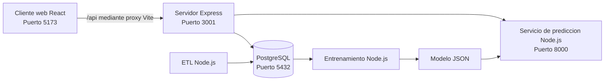

# Futbol Predice BI

Aplicacion de Inteligencia de Negocios para analizar eventos de futbol europeo y predecir el resultado probable de un partido.

La solucion usa PostgreSQL como unica base de datos y Node.js para el servidor, el ETL, el entrenamiento y el servicio de prediccion. El cliente web esta desarrollado con React y Vite.

## Funciones principales

- Carga de `events.csv` y `ginf.csv` mediante un proceso ETL.
- Limpieza, validacion y registro de filas rechazadas.
- Almacen dimensional en PostgreSQL.
- Registro e inicio de sesion con JWT.
- Diez usuarios de prueba con contrasenas cifradas.
- Tablero con indicadores y graficos.
- Consulta paginada de equipos, eventos y predicciones.
- Comparacion de equipos.
- Prediccion de `VICTORIA_LOCAL`, `EMPATE` o `VICTORIA_VISITANTE`.
- Guardado del historial de predicciones por usuario.

## Arquitectura



El navegador se comunica unicamente con Express mediante `/api`. Express consulta PostgreSQL y llama internamente al servicio de prediccion.

## Puertos finales

| Componente | Puerto | Direccion |
|---|---:|---|
| Cliente React | 5173 | `http://localhost:5173` |
| Servidor Express | 3001 | `http://localhost:3001` |
| Servicio de prediccion | 8000 | `http://localhost:8000` |
| PostgreSQL | 5432 | `localhost:5432` |

## Requisitos

- Windows 10 u 11.
- Node.js 20 o superior.
- npm.
- PostgreSQL 14, 15, 16, 17 o 18.
- Cliente `psql` incluido con PostgreSQL.

## Datos incluidos

Los archivos principales se encuentran en:

```text
datos/originales/events.csv
datos/originales/ginf.csv
datos/originales/dictionary.txt
```

`events.csv` contiene mas de 500000 registros. El modo muestra procesa una cantidad reducida de partidos para comprobar el funcionamiento con mayor rapidez.

## Instalacion desde cero

Abre PowerShell dentro de la carpeta `futbol-predice-bi`.

### 1. Instalar dependencias

```powershell
npm.cmd run instalar:todo
```

Tambien puedes usar:

```powershell
.\automatizacion\configurar.ps1
```

### 2. Crear y configurar PostgreSQL

Ejecuta:

```powershell
.\automatizacion\configurar-postgres.ps1
```

El asistente:

1. Busca `psql.exe` en el PATH y en versiones comunes de PostgreSQL.
2. Solicita el usuario y la contrasena local.
3. Crea la base `futbol_predice_bi`.
4. Crea los esquemas `preparacion`, `almacen`, `aplicacion` y `etl`.
5. Crea tablas, restricciones, indices y vistas.
6. Genera los archivos `.env` locales.
7. Crea los diez usuarios de prueba.
8. Comprueba la conexion final.

Los archivos `.env` no se incluyen en el ZIP porque contienen la contrasena local. El asistente los crea automaticamente.

### 3. Cargar datos de muestra

```powershell
npm.cmd run etl:muestra
```

Este comando procesa una parte de los CSV reales y permite comprobar la aplicacion rapidamente.

Para cargar todos los datos:

```powershell
npm.cmd run etl:completo
```

La carga completa puede tardar porque procesa cientos de miles de eventos y los valida antes de guardarlos.

### 4. Entrenar o actualizar el modelo

El ZIP ya incluye un modelo funcional. Para volver a entrenarlo con los datos cargados en PostgreSQL ejecuta:

```powershell
npm.cmd run modelo:entrenar
```

El proceso genera:

```text
modelos/modelo_resultado_futbol.json
modelos/metricas_modelo.json
```

### 5. Iniciar la aplicacion

```powershell
npm.cmd run desarrollo
```

Tambien puedes abrir tres terminales y ejecutar:

```powershell
npm.cmd run desarrollo:prediccion
npm.cmd run desarrollo:servidor
npm.cmd run desarrollo:cliente
```

Abre:

```text
http://localhost:5173/iniciar-sesion
```

## Usuarios de prueba

Contrasena comun:

```text
FutbolPredice2026!
```

Administrador:

```text
administrador@futbolpredice.local
```

Analistas:

```text
analista01@futbolpredice.local
analista02@futbolpredice.local
analista03@futbolpredice.local
analista04@futbolpredice.local
analista05@futbolpredice.local
analista06@futbolpredice.local
analista07@futbolpredice.local
analista08@futbolpredice.local
analista09@futbolpredice.local
```

Los usuarios tambien pueden volver a crearse sin duplicarlos mediante:

```powershell
npm.cmd run usuarios:prueba
```

## Comprobacion rapida

Antes de iniciar sesion abre:

```text
http://localhost:3001/api/salud
```

La respuesta muestra el estado de:

- Servidor Express.
- PostgreSQL.
- Servicio de prediccion.

El inicio de sesion puede funcionar aunque el servicio de prediccion este detenido. PostgreSQL y Express si deben estar activos.

Prueba directa del login desde PowerShell:

```powershell
$contenido = @{
  correo = "analista01@futbolpredice.local"
  contrasena = "FutbolPredice2026!"
} | ConvertTo-Json

Invoke-RestMethod `
  -Method Post `
  -Uri "http://localhost:3001/api/autenticacion/iniciar-sesion" `
  -ContentType "application/json" `
  -Body $contenido
```

## Correccion de `Failed to fetch`

El cliente usa una URL relativa:

```env
VITE_URL_API=/api
```

Vite envia `/api` a:

```text
http://localhost:3001
```

Si vuelve a aparecer el mensaje:

1. Comprueba `http://localhost:3001/api/salud`.
2. Revisa que PostgreSQL este iniciado.
3. Revisa la terminal de Express.
4. Deten y vuelve a iniciar Vite despues de modificar `.env`.
5. Comprueba que `cliente-web/.env` contenga `VITE_URL_API=/api`.
6. Comprueba que Express use `PUERTO=3001`.
7. No abras una copia antigua de la aplicacion en otro puerto.

## Pruebas y calidad

```powershell
npm.cmd run analizar
npm.cmd run pruebas
npm.cmd run compilar
```

Los comandos validan servidor, cliente y procesamiento de datos.

## Ejecucion desde VS Code

Abre la carpeta principal:

```powershell
code .
```

En `Terminal > Run Task` estan disponibles:

- `configurar postgres`
- `instalar todo`
- `desarrollo completo`
- `etl muestra`
- `etl completo`
- `entrenar modelo`
- `pruebas`
- `analizar`
- `compilar`

## Estructura principal

```text
futbol-predice-bi/
├── servidor/                 API Express y TypeScript
├── cliente-web/              React, Vite y Recharts
├── procesamiento-datos/      ETL, entrenamiento y prediccion Node.js
├── base-datos-postgres/      Scripts PostgreSQL
├── datos/originales/         Dataset
├── modelos/                  Modelo y metricas
├── automatizacion/           Scripts de configuracion e inicio
└── documentacion/            Documentacion tecnica
```

## Seguridad

- Las contrasenas se almacenan con bcrypt.
- La sesion usa JWT.
- Las consultas usan parametros PostgreSQL.
- Las rutas administrativas verifican el rol.
- El servidor limita intentos de inicio de sesion.
- Los secretos se guardan en archivos `.env` locales excluidos del repositorio.

## Limitaciones reales

- PostgreSQL debe estar instalado e iniciado en la computadora.
- La carga completa depende del rendimiento del equipo y del disco.
- La prediccion es una estimacion historica y no garantiza el resultado real de un partido.

## Comparacion por anos y escudos de equipos

El comando de muestra carga partidos distribuidos entre todos los anos disponibles del dataset:

```powershell
npm.cmd run etl:muestra
```

Si la base se habia cargado con una version anterior y solo mostraba 2011, ejecuta de nuevo el comando. El ETL es idempotente y agregara los periodos faltantes sin duplicar los partidos existentes.

Los escudos se consultan desde una URL externa mediante el servidor. No se guardan imagenes dentro del repositorio. Se necesita conexion a Internet para verlos; cuando un escudo no esta disponible, la interfaz muestra las iniciales del equipo.
