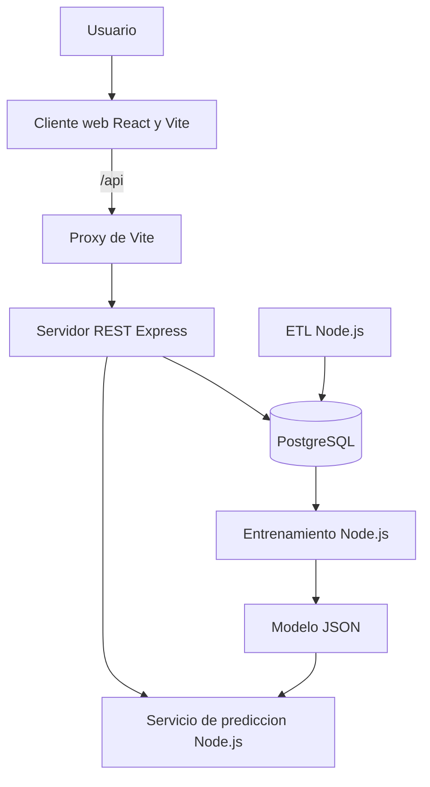

# Arquitectura

## Componentes



## Comunicacion

- React se ejecuta en el puerto `5173`.
- Express se ejecuta en el puerto `3001`.
- El servicio de prediccion se ejecuta en el puerto `8000`.
- PostgreSQL usa el puerto `5432`.
- El navegador solo consume rutas `/api`.
- Vite redirige `/api` hacia Express.
- Express consulta PostgreSQL mediante `pg.Pool`.
- Express consume internamente el servicio de prediccion.

## Servidor por capas

```text
ruta -> controlador -> servicio -> repositorio -> PostgreSQL
```

Los controladores no contienen consultas SQL. Los repositorios usan parametros `$1`, `$2` y siguientes.
